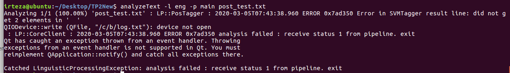
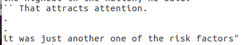
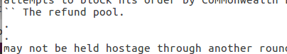
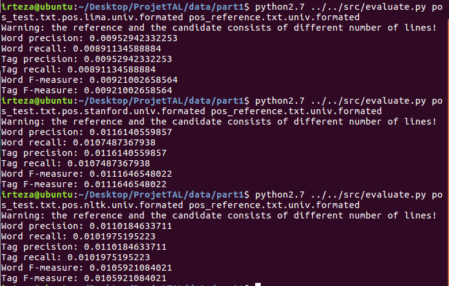
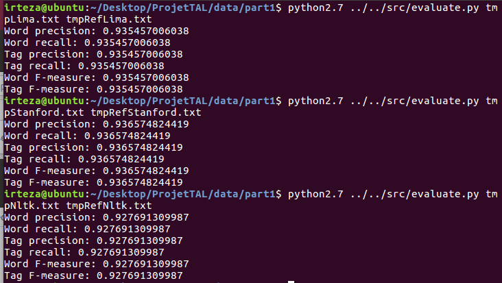
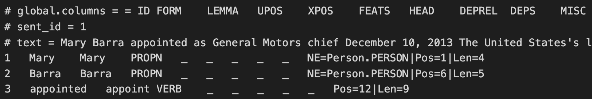
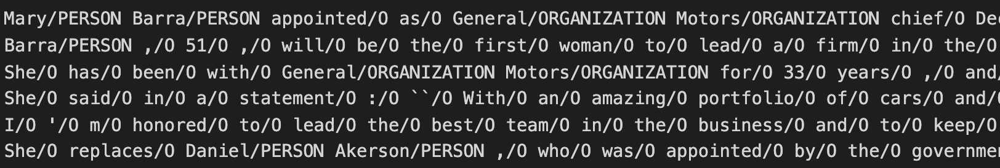
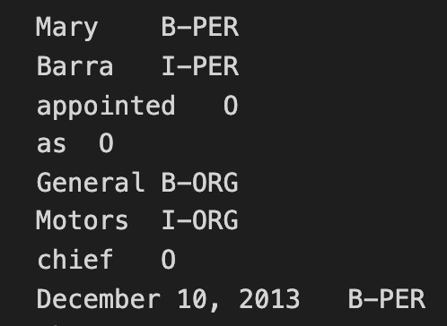
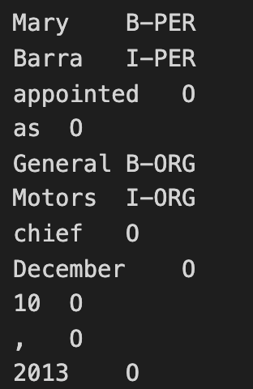
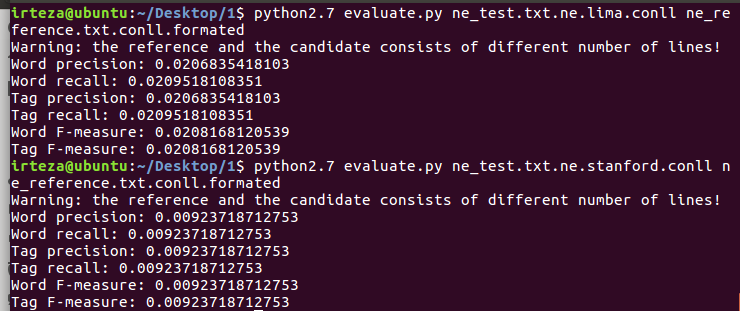

# Projet TAL

2019 - 2020 ET5 Polytech Paris Sud

Enseignant : M. Nasredine SEMMAR

Groupe : Irteza SHEIKH MUHAMMAD - Maïssa KHAMIS


## Pré-requis

Ubuntu 16.04 LTS et Python2.7.

Modules Stanford, LIMA et NLTK.


## Architecture

<ul>
<li>src : contient les codes sources des scripts Python du projet</li>
<li>doc : contient le rapport du projet</li>
<li>data : contient les données manipulées pour le projet</li>
<li>tp : contient les codes sources des scripts Python des TPs</li>
<li>screenshoots : contient des captures nécéssaires au rendu des README</li>
</ul>

## Projet
### 1 - Evaluation de l’analyse morpho-syntaxique

1)  Convertir les tags du corpus "pos_reference.txt.lima" en tags universels

    Pour convertir les tags du corpus LIMA en tags universels, il faut d'abords convertir les tags du corpus LIMA en tags PTB. Puis il faut convertir les tags PTB obtenus en tags universels.
    Pour réaliser ces conversions, il faut utiliser le script ScriptLimaToUniversal.py. Ce script prend 4 paramètres : le premier est le fichier Lima à convertir, le deuxième est le dictionnaire de conversion LIMA vers PTB (POSTags_LIMA_PTB_Linux.txt), le troisième est le dictionnaire de conversion PTB vers universel (POSTags_PTB_Universal_Linux.txt) et le dernier paramètre est le nom du fichier de sortie dans lequel on retrouvera les résultats de la conversion LIMA vers Universel.

    Exemple d'utilisation :

    ```bash
    -> python2.7 ScriptLimaToUniversal.py pos_reference.txt.lima POSTags_LIMA_PTB_Linux.txt POSTags_PTB_Universal_Linux.txt pos_reference.txt.univ
    ```
<br/><br/>

2)  Extraire les phrases du corpus "pos_reference.txt.univ"

    Pour extaire les phrases du corpus "pos_reference.txt.univ", il faut lire ligne par ligne ce fichier. Lorsque la ligne lue est vide, on considère qu'il s'agit d'une fin de phrase, lorsque la ligne lue n'est pas vide on ajoute le mot à la ligne courante lue. Pour réaliser cette extraction, on utilise le script "ScriptExtractor.py". Ce script prend 2 paramètres : le premier est le fichier duquel il faut extraire les phrases et le deuxième est le fichier dans lequel va se trouver le résultat de cette extraction.

    Exemple d'utilisation :

    ```bash
    -> python2.7 ScriptExtractor.py pos_reference.txt.univ pos_test.txt
    ```
<br/><br/>

3) Lancer les trois POS taggers sur le fichier « pos_test.txt »


    
    
    Attention, afin d'eviter de rencontrer l'erreur suivante avec Lima :

    

    Assurez vous de ne pas avoir les deux points aux lignes 131 et 147 au sein du fichier "pos_test.txt" fournit à Lima : 
    
    

    et


    

    Si les deux points sont présents, il faut les supprimer. Le fichier pos_test.txt fournit dans /data à été corrigé.
    ___

    Pour Lima, on execute la commande suivante :  
    ```bash
    -> analyzeText -l eng -p main pos_test.txt > pos_test.txt.conllu
    ```
    Le résultat est stocké dans le fichier pos_test.txt.conllu. Pour convertir le résultat du POS Taggers lima dans le même format que le corpus « pos_reference.txt.lima » on utilise le script ScriptLimaPOSExtractor.py. Ce script prend 2 paramètres : le premier est le chemin vers le fichier de sortie lima à extraire, le deuxième est le chemin vers le fichier de sortie

    Exemple d'utilisation :

    ```bash
    -> python2.7 ScriptLimaPOSExtractor.py pos_test.txt.conllu pos_test.txt.pos.lima
    ```
    ___

    Pour Stanford, on execute la commande suivante :  
    ```bash
    ./stanford-postagger.sh models/english-left3words-distsim.tagger pos_test.txt > pos_test.txt.pos.stanford
    ```
    Le résultat est stocké dans le fichier pos_test.txt.pos. Il n'est pas sous le même format que "pos_reference.txt.pos.stanford".


    ___

    Pour NLTK, on execute tout d'abords la commande suivante :  
    ```bash
    -> python2.7 script1-1.py pos_test.txt pos_test.txt.pos.nltk
    ```

<br/><br/>


4) Convertir les résultats des trois POS taggers en utilisant les étiquettes universelles

    Pour Lima, on réutilise le script précedemment utilisé ScriptLimaToUniversal.py de la manière suivante :  
    ```bash
    -> python2.7 ScriptLimaToUniversal.py pos_test.txt.pos.lima POSTags_LIMA_PTB_Linux.txt POSTags_PTB_Universal_Linux.txt pos_test.txt.pos.lima.univ
    ```
    ___

    Pour Stanford, on utilise le script ScriptStanfordToUniversal.py. Ce script va convertir le format du résultat de stanford sous la même forme que le format du fichier "pos_reference.txt.lima" (2 colonnes séparées par une tabulation), et va aussi convertir le résultat de postag stanford en étiquettes universelles. Ce script prend 3 paramètres : le premier est le résultat de l'analyse postag stanford, le deuxième est le dictionnaire de conversion de tags PTB en universels et le dernier est le nom du fichier de sortie de convertion.

    Exemple d'utilisation :

    ```bash
    -> python2.7 ScriptStanfordToUniversal.py pos_test.txt.pos.stanford POSTags_PTB_Universal_Linux.txt pos_test.txt.pos.stanford.univ
    ```

     ___

    Pour NLTK, on utilise le script UniversalConverter.py. Ce script va convertir le format du résultat de nltk sous la même forme que le format du fichier "pos_reference.txt.lima" (2 colonnes séparées par une tabulation), et va aussi convertir le résultat de postag nltk en étiquettes universelles. Ce script prend 3 paramètres : le premier est le résultat de l'analyse postag nltk, le deuxième est le dictionnaire de conversion de tags PTB en universels et le dernier est le nom du fichier de sortie de convertion.

    Exemple d'utilisation :

    ```bash
    -> python2.7 ScriptNLTKToUniversal.py pos_test.txt.pos.nltk POSTags_PTB_Universal_Linux.txt pos_test.txt.pos.nltk.univ
    ```

<br/><br/>


5) Evaluation des trois POS taggers

    Avant de lancer l'évaluation des trois POS taggers on éxécute le script ScriptRemoveBlankLines.py afin de retirer toutes les lignes vides au sein des fichiers de résultats Lima, Stanford, NLTK et aussi du fichier de réference. On le fait de la manière suivante : 
    ```bash
    -> python2.7 ScriptRemoveBlankLines.py pos_test.txt.pos.lima.univ pos_test.txt.pos.lima.univ.formated
    -> python2.7 ScriptRemoveBlankLines.py pos_test.txt.pos.stanford.univ pos_test.txt.pos.stanford.univ.formated
    -> python2.7 ScriptRemoveBlankLines.py pos_test.txt.pos.nltk.univ pos_test.txt.pos.nltk.univ.formated
    -> python2.7 ScriptRemoveBlankLines.py pos_reference.txt.univ pos_reference.txt.univ.formated
    ```
    
    
    
    L'évaluation des trois POS taggers s'éffectue à l'aide du script evaluate.py fournit ainsi que du fichier pos_reference.txt.univ précédement obtenu.

    On éxecute le script de la manière suivante pour chaqu'un des 3 outils étudiés :

    ```bash
    -> python2.7 evaluate.py pos_test.txt.pos.lima.univ.formated pos_reference.txt.univ.formated
    -> python2.7 evaluate.py pos_test.txt.pos.stanford.univ.formated pos_reference.txt.univ.formated
    -> python2.7 evaluate.py pos_test.txt.pos.nltk.univ.formated pos_reference.txt.univ.formated
    ```

    Le script evaluate.py va comparer les deux fichiers passés en paramètres ligne par ligne. 

    On obtiens les résultats suivant :


    

    ___

    On peux tout de même remarquer que les fichiers de résultats LIMA, Stanford et NLTK ne contiennent pas tous le même nombres de lignes. Le mécanisme de tokenization n\'étant pas la même d\'un outil à un autre, il est plus que probable que certains termes ne soient pas découpés de la même manière, résultant ainsi un nombre différents de lignes sur leurs fichiers de résultats respectifs.
    Afin de formater les fichiers de résultats avec le fichier de référence, on peut utiliser le script ScriptResultsFormater.py. Ce dernier va comparer les deux fichiers passés en paramètres et produire 2 fichiers de sorties avec les mêmes mots sur leur colonne de gauche.
    Ce script prend 4 paramètres : le premier est le fichier de résultat (Lima, Stanford ou NLTK), le deuxième est le fichier de référence, le troisième est le path où va être créer le fichier de résultat formaté et le dernier est la path où va être créer le fichier de référence formaté.
    Chaque outils aura donc 1 fichier de résultat formaté associé à 1 fichier de référence.
    On lance le script de la manière suivante :

    ```bash
    -> python2.7 ScriptResultsFormater.py pos_test.txt.pos.lima.univ pos_reference.txt.univ tmpLima.txt tmpRefLima.txt
    -> python2.7 ScriptResultsFormater.py pos_test.txt.pos.stanford.univ pos_reference.txt.univ tmpStanford.txt tmpRefStanford.txt
    -> python2.7 ScriptResultsFormater.py pos_test.txt.pos.nltk.univ pos_reference.txt.univ tmpNltk.txt tmpRefNltk.txt
    ```

    On lance par la suite le script evaluate.py sur chaque pair de fichiers :
    ```bash
    -> python2.7 evaluate.py tmpLima.txt tmpRefLima.txt
    -> python2.7 evaluate.py tmpStanford.txt tmpRefStanford.txt
    -> python2.7 evaluate.py tmpNLTK.txt tmpRefNLTK.txt
    ```
    

    On obtiens les résultats suivant :


    


<br/><br/><br/><br/>
### 2 - Evaluation de la reconnaissance d’entités nommées

1)  Extraire les phrases du corpus "ne_reference.txt.conll"
    
    Pour extraire les phrases du corpus "ne_reference.txt.conll" on utilise le script ScriptExtractor.py. Ce script prend 2 paramètres : le premier est le fichier duquel il faut extraire les phrases et le deuxième est le fichier dans lequel va se trouver le résultat de cette extraction.

    Exemple d'utilisation :

    ```bash
    -> python2.7 ScriptExtractor.py ScriptExtractor.py ne_reference.txt.conll ne_test.txt
    ```
<br/><br/>

2) Lancer les trois NE recognizers sur le fichier "ne_test.txt"
    ___

    Pour Lima, on execute la commande suivante :  
    ```bash
    -> analyzeText -l eng -p main ne_test.txt > ne_test.txt.lima
    ```
    Le résultat est stocké dans le fichier ne_test.txt.conllu sous la forme :
    
    

    ___

    Pour Stanford, on execute la commande suivante :  
    ```bash
    -> java -mx600m -cp stanford-ner.jar:lib/* edu.stanford.nlp.ie.crf.CRFClassifier -loadClassifier classifiers/english.all.3class.distsim.crf.ser.gz -textFile ne_test.txt > ne_test.txt.stanford
    ```

    Le résultat est stocké dans le fichier ne_test.txt.stanford sous la forme :
    
    


<br/><br/>


3) Convertir le résultat des trois NE recognizers en étiquettes CoNLL-2003
    ___

    Pour Lima, il faut utiliser le script ScriptLimaToConll.py pour extraire les résultats du NE recognizers Lima les convertir en étiquettes CoNLL-2003. Ce script va aussi convertir le fichier fournit en entré dans le même format que le fichier "ne_reference.txt.conll". Le script ScriptLimaToConll.py prend 2 paramètres : le premier est le fichier de résultat brut de Lima et le second est le l'emplacement du fichier de sortie
    
    Exemple d'utilisation :

    ```bash
    -> python2.7 ScriptLimaToConll.py ne_test.txt.lima ne_test.txt.ne.lima.conll
    ```
    On obtiens donc ne_test.txt.ne.lima.conll sous cette forme :


    

    ___

    Pour Stanford, il faut utiliser le script ScriptStanfordToConll.py pour extraire les résultats du NE recognizers Stanford les convertir en étiquettes CoNLL-2003. Le script ScriptStanfordToConll.py prend 2 paramètres : le premier est le fichier de résultat brut de stanford et le second est le l'emplacement du fichier de sortie


    Exemple d'utilisation :

    ```bash
    -> python2.7 ScriptStanfordToConll.py ne_test.txt.stanford ne_test.txt.ne.stanford.conll
    ```

    On obtiens donc ne_test.txt.ne.stanford.conll sous cette forme :


    


<br/><br/>

4) Evaluation des deux NE Recognizers

    Avant de lancer l'évaluation des deux POS taggers on éxécute le script ScriptRemoveBlankLines.py afin de retirer toutes les lignes vides du fichier de réference. On le fait de la manière suivante : 
    ```bash
    -> python2.7 ScriptRemoveBlankLines.py ne_reference.txt.conll ne_reference.txt.conll.formated
    ```

    L'évaluation des trois NE Recognizer s'éffectue à l'aide du script evaluate.py fournit ainsi que du fichier ne_reference.txt.conll.formated précédement obtenu.

    On éxecute le script de la manière suivante pour chaqu'un des outils étudiés :

    ```bash
    -> python2.7 evaluate.py ne_test.txt.ne.lima.conll ne_reference.txt.conll.formated
    -> python2.7 evaluate.py ne_test.txt.ne.stanford.conll ne_reference.txt.conll.formated
    ```

    On obtiens les résultats suivants :

    