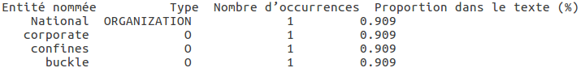
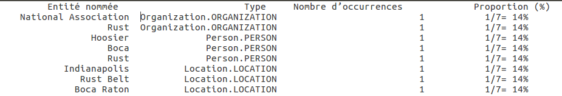
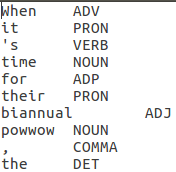

# ProjetTAL/tp


2019 - 2020 ET5 Polytech Paris Sud

Enseignant : M. Nasredine SEMMAR

Groupe : Irteza SHEIKH MUHAMMAD - Maïssa KHAMIS

Ce dossier contient les codes sources des script Python des trois TP

## Pré-requis

Ubuntu 16.04 LTS et Python2.7


## TP1
1 - Installation et évaluation de l’outil de désambiguïsation morpho- syntaxique de l’université de Stanford

2)  Evaluation sans étiquettes universelles

    Pour comparer les fichiers wsj_0010_sample.txt.pos.stanford et wsj_0010_sentence.pos.ref, il faut que les deux fichiers soient aux même format. Pour cela on utilise le script nommé TP1_1.py en rensaignant 2 paramètres : le premier est le path vers le fichier wsj_0010_sample.txt.pos.stanford et le deuxième est le fichier de sorti converti au bon format.
    
    Exemple :

    ```bash
    -> python2.7 TP1_1.py wsj_0010_sample.txt.pos.stanford wsj_0010.txt.pos.stanford.formated
    ```

    On lance ensuite la comparaison :
    ```bash
    -> python2.7 evaluate.py wsj_0010.txt.pos.stanford.formated wsj_0010_sample.pos.ref
    ```

2)  Evaluation avec étiquettes universelles wsj_0010_sample.txt.pos.stanford et wsj_0010_sentence.pos.ref (s'assurer au préalable qu'ils sont tout les deux au bon format), on utilise le script nommé UniversalConverter.py qui prend 3 paramètres : le premier est le path vers le fichier à convertir, le deuxième est le fichier de référence et le troisième est le fichier de sorti

    Exemple :

    ```bash
    -> python2.7 UniversalConverter.py wsj_0010_sample.txt.pos.stanford.formated POSTags_PTB_Universal_Linux.txt  wsj_0010_sample.txt.pos.stanford.formated.univ
    -> python2.7 UniversalConverter.py wsj_0010_sample.pos.ref POSTags_PTB_Universal_Linux.txt wsj_0010_sample.pos.ref.univ
    ```

    On lance ensuite la comparaison :
    ```bash
    -> python2.7 evaluate.py wsj_0010.txt.pos.stanford.formated.univ wsj_0010_sample.pos.ref.univ
    ```


2 - Evaluation d’entités nommées


On lance d'abords le Stanford NE Recognizer sur le fichier "wsj_0010_sample.txt.ner.stanford" de la manière suivante :

```bash
-> java -mx600m -cp stanford-ner.jar:lib/* edu.stanford.nlp.ie.crf.CRFClassifier -loadClassifier classifiers/english.all.3class.distsim.crf.ser.gz -textFile wsj_0010_sample.txt > wsj_0010_sample.txt.ner.stanford.output
```

Pour ensuite extraire les entités nommées, il faut lancer le script TP1_ExtractEntity.py avec 2 arguments : le premier est le fichier de sortit brut de Stanford NE Recognizer (wsj_0010_sample.txt.ner.stanford.output) et le deuxième le fichier de résultat final

```bash
-> python2.7 TP1_ExtractEntity.py wsj_0010_sample.txt.ner.stanford.output wsj_0010_sample.txt.ner.stanford.output.formated
```

On obtiens donc "wsj_0010_sample.txt.ner.stanford.output.formated" sous la forme :




## TP2
2 - Extraction d’entités nommées

Il suffit de lancer le script TP2_ExtractEntiteNommees.py avec 2 arguments... : le premier est le chemin vers le fichier wsj_0010_sample.txt.se.xml et le deuxième est le chemin vers le fichier de sortie.

Exemple d'utilisation

```bash
-> python2.7 TP2_ExtractEntiteNommees.py wsj_0010_sample.txt.se.xml extracted-data.txt
```
On obtiens le résultat suivant dans le fichier "extracted-data.txt" : 





3 - Analyse morpho-syntaxique

A partir de la sortie de l’analyseur LIMA « wsj_0010_sample.txt.disambiguated.xml » ou
« wsj_0010_sample.txt.conllu », écrire un
étiquettes morpho-syntaxiques sous le format « Mot_Etiquette ».


Il faut lancer le script TP2_ScriptMorphoSynt.py avec 2 arguments : le premier est le chemin vers le fichier de sortie brut de lima et le deuxième le chemin vers lequel le fichier de résultat va être écrit

```bash
-> python2.7 TP2_ScriptMorphoSynt.py wsj_0010_sample.txt.conllu wsj_0010_sample.txt.pos.lima
```
On obtiens le fichier wsj_0010_sample.txt.pos.lima suivant : 




3 - Evaluation de l’analyse morpho-syntaxique

Pour convertir les étiquettes des fichiers « wsj_0010_sample.txt.pos.lima » et « wsj_0010_sample.txt.pos.ref » en étiquettes universelles, on utilise le script ScriptLimaToUniversal.py. Ce script prend 4 paramètres : le premier est le fichier Lima à convertir, le deuxième est le dictionnaire de conversion LIMA vers PTB (POSTags_LIMA_PTB_Linux.txt), le troisième est le dictionnaire de conversion PTB vers universel (POSTags_PTB_Universal_Linux.txt) et le dernier paramètre est le nom du fichier de sortie dans lequel on retrouvera les résultats de la conversion LIMA vers Universel.

Exemple d'utilisation :

```bash
-> python2.7 ScriptLimaToUniversal.py wsj_0010_sample.txt.pos.lima POSTags_LIMA_PTB_Linux.txt POSTags_PTB_Universal_Linux.txt wsj_0010_sample.txt.pos.univ.lima
-> python2.7 ScriptLimaToUniversal.py wsj_0010_sample.pos.ref POSTags_LIMA_PTB_Linux.txt POSTags_PTB_Universal_Linux.txt wsj_0010_sample.txt.pos.univ.ref
```


## TP3
1 - Evaluation de l’analyse morpho-syntaxique de la plateforme NLTK
    
Utiliser le script TP3_Script1-1.py pour désambiguïser morpho-syntaxiquement le texte du fichier wsj_0010_sample.txt. Ce script prend 2 paramètres : le premier est le chemin vers le fichier "wsj_0010_sample.txt" et le deuxième est le chemin vers le fichier de sortie.

Exemple d'utilisation :

```bash
-> python2.7 TP3_Script1-1.py wsj_0010_sample.txt wsj_0010_sample.txt.pos.nltk
```

Avant de comparer le fichier avec le fichier de référence , il faut faire en sorte qu'il y ai les mêmes mots sur la colonne gauche de chacun des deux fichiers. On utilise donc le script ScriptResultsFormater.py afin de réaliser cette transformation. Ce script prend 4 paramètres : le premier est le fichier de résultat nltk (wsj_0010_sample.txt.pos.nltk), le deuxième est le fichier de référence (wsj_0010_sample.pos.ref)), le troisième est le path où va être créer le fichier de résultat formaté et le dernier est la path où va être créer le fichier de référence formaté.

Exemple d'utilisation :

```bash
-> python2.7 ScriptResultsFormater.py wsj_0010_sample.txt.pos.nltk wsj_0010_sample.pos.ref wsj_0010_sample.txt.pos.nltk.formated wsj_0010_sample.pos.ref.formated
```

Il suffit alors de lancer le script evaluate.py sur les deux fichiers obtenus, dans notre cas :
```bash
-> python2.7 evaluate.py wsj_0010_sample.txt.pos.nltk.formated wsj_0010_sample.pos.ref.formated
```

2 - Utilisation de la plateforme NLTK pour l’analyse syntaxique

On utilisera le script TP3_ScriptGrammaire.py pour extraire les mots composés (chunks) ayant la structure syntaxique souhaitée présents dans le texte du fichier wsj_0010_sample.txt. Ce script prend 2 paramètres : le premier est le chemin vers le fichier wsj_0010_sample.txt, le deuxième est la structure syntaxique souhaitée. Voici les différentes structure syntaxique disponible :
```bash
0 = Déterminant-Adjectif-Nom
1 = Adjectif-Nom
2 = Nom-Nom
3 = Adjectif-Nom-Nom
4 = Adjectif-Adjectif-Nom
```


Exemple d'utilisation :

```bash
->  python2.7 TP3_ScriptGrammaire.py wsj_0010_sample.txt 3
```
